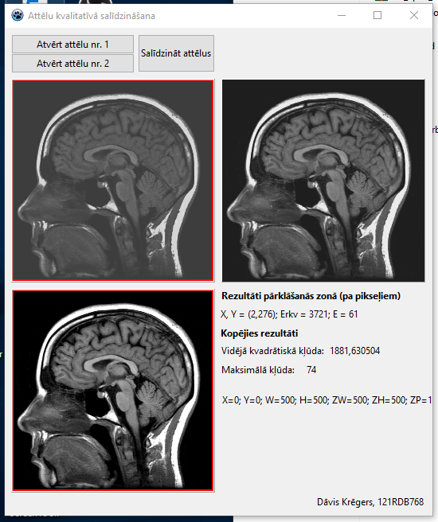

# Compare images

A program for comparing two color images and calculating mean quadratic error, max error.

You can view the result image and by hovering the mouse over it, view the errors on each pixel separately.

